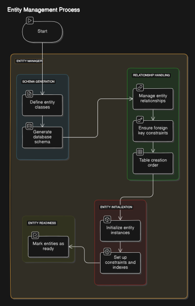
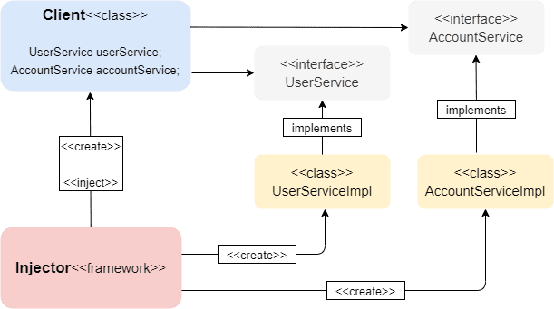

# Codex Framework

## Overview

The Codex Framework is a comprehensive Java framework designed to streamline application development by offering robust dependency injection, custom ORM, data mapping, and automated database schema generation. It integrates annotation-based configuration to simplify entity management and dependency handling.

## Features

- **Dependency Injection**: Streamline object creation and dependency management.
- **Custom ORM**: Simplify database interactions with an intuitive ORM.
- **Data Mapping**: Effortlessly map database tables to Java objects.
- **Automated Table Creation**: Automatically generate database tables from your Java classes.
- **Annotation-Based Configuration**: Configure your entities and dependencies using annotations for cleaner and more maintainable code.

## Usage

### Main Application

Create a main class and use the `Kernel.run()` method to start your application:

```java
import com.codex.framework.Kernel;

public class Main {

    public static void main(String[] args) throws Exception {
        Kernel.run(Main.class);
    }
}
```

### Dependency Injection

Use annotations to define and inject dependencies:

```java
package com.codex.testing.Components;

import com.codex.framework.DIContainer.annotations.Autowired;
import com.codex.framework.DIContainer.annotations.Component;
import com.codex.framework.DIContainer.annotations.Qualifier;
import com.codex.testing.Components.interfaces.IBook;
import com.codex.testing.Components.interfaces.IUser;

@Component
public class Book implements IBook {
    private IUser user;

    @Autowired
    @Qualifier(User2.class)
    public Book(IUser user) {
        this.user = user;
    }

    @Override
    public void index() {
        System.out.println(user.getName());
    }
}
```

### Entity Creation

Define entities using annotations:

```java
package com.codex.testing.entities;

import com.codex.framework.EntityManager.Annotations.Column.Column;
import com.codex.framework.EntityManager.Annotations.Entity.Entity;
import com.codex.framework.EntityManager.Annotations.Entity.Table;
import com.codex.framework.EntityManager.Annotations.Id.ID;
import com.codex.framework.EntityManager.Annotations.Relationship.*;

import java.util.Set;

@Entity
@Table(name = "Administrator")
public class Admin {
    @ID
    private String id;
    
    @Column
    private String name;
    
    @ManyToOne(cascade = "PERSIST")
    private Employee employee_id;

    @ManyToMany(cascade = "REFRESH")
    @JoinTable(
            name = "admin_roles",
            joinColumns = @JoinColumn(name = "admin_id"),
            inverseJoinColumns = @JoinColumn(name = "role_id")
    )
    private Set<Roles> roles;
}

package com.codex.testing.entities;

import com.codex.framework.EntityManager.Annotations.Column.Column;
import com.codex.framework.EntityManager.Annotations.Entity.Entity;
import com.codex.framework.EntityManager.Annotations.Id.ID;

@Entity
public class Employee {
    @ID
    private int id;
    
    @Column(name = "em_name")
    private String name;
}

package com.codex.testing.entities;

import com.codex.framework.EntityManager.Annotations.Column.Column;
import com.codex.framework.EntityManager.Annotations.Entity.Entity;
import com.codex.framework.EntityManager.Annotations.Id.ID;

@Entity
public class Roles {
    @ID
    private String id;

    @Column
    private String name;
}
```

## Installation

1. Clone the repository:

    ```bash
    git clone git@github.com:bouanani-soufiane/Codex-Framework.git
    ```

2. Navigate to the project directory:

    ```bash
    cd Codex-Framework
    ```

3. Install the framework to your local Maven repository:

    ```bash
    mvn clean install
    ```

4. Add the following dependency to your project's `pom.xml`:

    ```xml
   <dependency>
       <groupId>com.codex</groupId>
       <artifactId>Codex</artifactId>
       <version>1.0-SNAPSHOT</version>
   </dependency>
    ```

## Structure

| Entity Manager Process                     | IOC Context                            |
|--------------------------------------------|----------------------------------------|
|  |  |


## Contributing

- Fork the repository and create a new branch.
- Write clear and concise commit messages.
- Ensure all tests pass before submitting a pull request.
- Follow the project's coding standards and guidelines.

## License

This project is licensed under the MIT License - see the [LICENSE](LICENSE) file for details.

---
